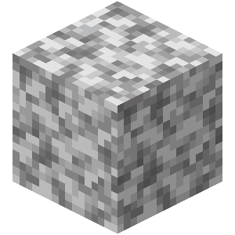

# Diorite

A websocket API for Minecraft Bedrock Edition designed for easy use and enabling complex projects. This project is still a WIP, make sure to update to the latest version.

## Features
- FMBE Loading

## Requirements
- Minecraft Bedrock Edition
- A code editor (VSCode)
- Node.js
- Knowledge of JavaScript

## Installation
`npm install diorite`

To update Diorite to the latest version and the Node.js dependencies of the package, run `npm install diorite@latest`

## Usage
tbd

## Documentation
tbd